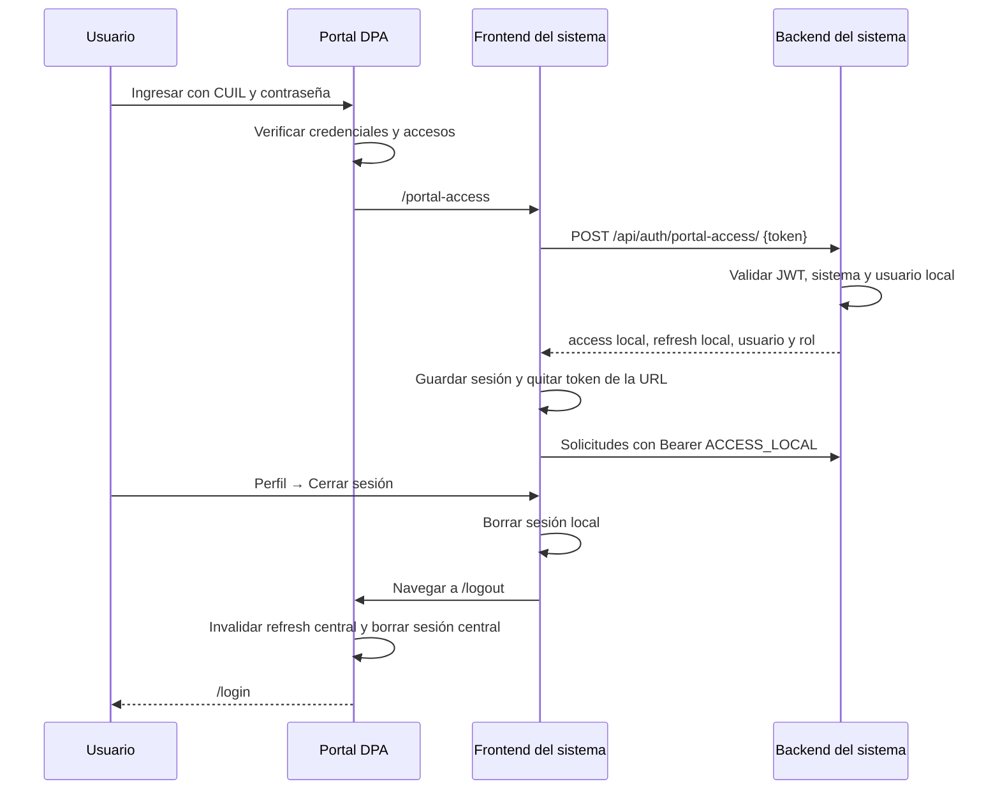

# Guía para implementar autenticación del Portal DPA en otro sistema

Documento para entregar a una IA de desarrollo junto con los archivos de referencia. Basado en el código local de `portaldpa` y `movildpa`, revisado el 5 de octubre de 2026. No contiene valores reales de secretos.

Referencia del sistema integrado: `C:\Users\Enzo\Documents\GitHub\movildpa`.
Referencia del portal central: `C:\Users\Enzo\Documents\GitHub\portaldpa`.

## 1. Instrucción para la IA de desarrollo

Implementá en este proyecto la integración de autenticación con el Portal DPA usando Móvil DPA como referencia. Revisá primero la estructura, el modelo de usuario, las rutas, el cliente HTTP y el topbar existentes. Adaptá la solución a este sistema, conservando sus datos y funcionalidades.

El resultado debe incluir:

1. Una ruta pública frontend `/portal-access` que recibe el access token del portal.
2. Un endpoint backend `POST /api/auth/portal-access/` que valida ese token, comprueba el acceso al sistema, sincroniza el usuario local y emite tokens locales.
3. Sesión local y envío de `Authorization: Bearer <access_local>` en las solicitudes protegidas.
4. Protección real de los endpoints backend y protección de navegación frontend.
5. Roles locales y permisos adecuados a las secciones de este sistema.
6. Un botón **Cerrar sesión** dentro del desplegable de perfil del topbar que limpia la sesión local y redirige a `/logout` del portal central.
7. Manejo de errores y las verificaciones de la sección final.

Usá las variables de entorno de esta guía. No copies credenciales, bases de datos, migraciones iniciales ni módulos de negocio de Móvil. Si el proyecto usa otra tecnología, implementá los mismos contratos y comportamientos con las herramientas de ese proyecto. Documentá los archivos modificados, las migraciones necesarias y las verificaciones realizadas.

Aplicá las correcciones de compatibilidad de la sección 8; forman parte de la implementación solicitada. No reproduzcas automáticamente los problemas detectados en el ejemplo.

## 2. Arquitectura y flujo

El portal central autentica al empleado. Cada sistema mantiene su propia base de datos, su usuario local y su rol local. El ID del usuario en el portal y el ID local pueden ser distintos.



El portal genera el enlace desde `frontend/src/lib/session.js`, mediante `buildSystemLaunchUrl`. Prefiere el fragmento `#portal_token=...`. El fragmento no se envía al servidor al cargar la página, pero el frontend puede leerlo.

### Token de entrada del portal

En `backend/accounts/serializers.py`, `PortalLoginSerializer.build_token_pair` agrega estos claims al par JWT:

```json
{
  "user_id": 123,
  "username": "usuario.portal",
  "nombre_completo": "Nombre Apellido",
  "rol": "ROL_DEL_PORTAL",
  "oficina": "CODIGO_OFICINA",
  "sistemas": ["movil", "otro-sistema"]
}
```

También contiene los claims JWT generados por SimpleJWT, como `exp`, `iat`, `jti` y `token_type`. El acceso al sistema depende del código incluido en `sistemas`; el ejemplo anterior es ilustrativo, no una lista de códigos obligatorios.

El rol del portal no se convierte automáticamente en el rol local. Móvil asigna `PORTAL_DEFAULT_ROLE` a usuarios nuevos y conserva el rol local de usuarios existentes. No asignar administrador por el solo hecho de recibir un token válido.

## 3. Variables de entorno

### Backend del sistema receptor

```dotenv
SECRET_KEY=<secreto_django_de_este_sistema>
DB_NAME=<base_de_este_sistema>
DB_USER=<usuario_db>
DB_PASSWORD=<password_db>
DB_HOST=localhost
DB_PORT=5432
ENVIRONMENT=LOCAL

CORS_ALLOWED_ORIGINS=http://localhost:5176

SIGNING_KEY=<misma_clave_jwt_que_utiliza_el_portal>

PORTAL_SYSTEM_CODE=<codigo_exacto_del_sistema_en_el_portal>
PORTAL_DEFAULT_ROLE=CONSULTOR
PORTAL_AUTO_ENABLE_USERS=true
```

| Variable | Uso |
| --- | --- |
| `SECRET_KEY` | Secreto de Django del sistema receptor. Puede ser distinto del secreto de Django del portal. |
| `DB_*` | Conexión a la base local; no a la base del portal. |
| `ENVIRONMENT` | Móvil activa DEBUG para `LOCAL`, `L`, `DEV` o `DEVELOPMENT`. Adaptar al proyecto destino. |
| `CORS_ALLOWED_ORIGINS` | Lista separada por comas de los orígenes frontend que llaman a este backend. Incluir esquema y puerto; no rutas. |
| `SIGNING_KEY` | En el esquema actual HS256 se comparte con el portal para verificar y emitir JWT. Configurar explícitamente y mantener solo en backend. |
| `PORTAL_SYSTEM_CODE` | Código del registro de sistema del portal, no nombre visible ni URL. No permitir que quede vacío. |
| `PORTAL_DEFAULT_ROLE` | Rol local inicial para usuarios sincronizados nuevos. |
| `PORTAL_AUTO_ENABLE_USERS` | Con `true`, Móvil reactiva usuarios locales existentes al ingresar desde el portal. La política debe ser explícita. |

Si se reutiliza el código de permisos de Móvil, también hay que activar `ACCESS_CONTROL_ENABLED=true`, o cambiar el código para que la protección esté siempre activa. No alcanza con configurar solamente las variables listadas arriba: en Móvil ese flag tiene valor predeterminado `false`.

En producción, el proyecto además debe configurar los hosts permitidos y sus ajustes de despliegue existentes. Móvil usa `ALLOWED_HOSTS`, que queda vacío fuera de desarrollo si no se configura.

### Frontend del sistema receptor

Las variables habituales del usuario son:

```dotenv
VITE_API_URL=http://localhost:8000
VITE_PORTAL_BASE_URL=http://localhost:5173
VITE_PORTAL_LOGIN_URL=http://localhost:5173
VITE_PORTAL_API_URL=http://localhost:8001/api
```

Para una integración con el portal revisado, usar la ruta de login explícita:

```dotenv
VITE_API_URL=http://localhost:8000
VITE_PORTAL_BASE_URL=http://localhost:5173
VITE_PORTAL_LOGIN_URL=http://localhost:5173/login
VITE_PORTAL_API_URL=http://localhost:8001/api
```

| Variable | Significado |
| --- | --- |
| `VITE_API_URL` | Backend del sistema receptor. El cliente HTTP de Móvil agrega `/api/` si falta. |
| `VITE_PORTAL_BASE_URL` | Frontend del portal central. Se usa para navegar a su `/logout`. No es la URL del sistema receptor. |
| `VITE_PORTAL_LOGIN_URL` | Página de login central, normalmente `<frontend_portal>/login`. |
| `VITE_PORTAL_API_URL` | API central. El flujo actual de Móvil revisado no usa esta variable: el canje va al backend local y el logout central se ejecuta navegando al frontend del portal. |

Los puertos son ejemplos: verificar dónde corre cada servicio. El propio frontend de `portaldpa` utiliza `VITE_API_BASE_URL` para su API; no confundir esa configuración con las variables del sistema receptor.

Todas las variables `VITE_*` son públicas. Nunca poner `SIGNING_KEY`, contraseñas ni secretos en ellas. Reiniciar el servidor Vite o reconstruir el frontend después de modificarlas.

## 4. Backend: contrato y sincronización

### Endpoint público de intercambio

```http
POST /api/auth/portal-access/
Content-Type: application/json

{"token":"ACCESS_TOKEN_DEL_PORTAL"}
```

Debe permitir iniciar sin sesión local. En el destino, configurar tanto `permission_classes = [AllowAny]` como `authentication_classes = []` para evitar que un header Bearer local vencido bloquee el intercambio antes de validar el token del cuerpo.

Secuencia requerida:

1. Validar que `token` sea un string no vacío.
2. Verificar firma y expiración con el algoritmo configurado por el backend, nunca elegido libremente por el cliente. En el esquema actual, usar SimpleJWT/TokenBackend y la clave compartida.
3. Exigir `token_type == "access"`. No aceptar refresh tokens como credencial de entrada.
4. Normalizar `sistemas` y el código configurado con la misma regla (`strip().lower()`), exigir que el código esté presente y rechazar configuración vacía.
5. Leer `user_id` como identidad central y `username` como dato de sincronización.
6. Buscar primero por `portal_user_id`. Móvil también tiene un fallback por `username`; al adaptarlo, impedir que ese fallback vincule o sobrescriba una cuenta ya asociada a otro ID central. Resolver colisiones de username de forma explícita.
7. Crear el usuario local si no existe, asignar `CONSULTOR` u otro rol configurado y llamar a `set_unusable_password()`.
8. Actualizar los datos de identificación y nombre disponibles; conservar el rol local existente. El portal entrega `nombre_completo`: Móvil separa el último término como apellido; adaptar si el sistema necesita nombres compuestos exactos.
9. Aplicar la política de activación local. Con autoactivación deshabilitada, un usuario local inactivo debe seguir rechazado.
10. Ejecutar la sincronización dentro de una transacción y emitir el par JWT local solo para un usuario habilitado.

Móvil no sincroniza `documento` desde ese token; no asumir que la respuesta siempre lo incluye con valor ni inferirlo arbitrariamente del username.

### Respuesta de éxito compatible con Móvil

```json
{
  "access": "ACCESS_LOCAL",
  "refresh": "REFRESH_LOCAL",
  "rol": "CONSULTOR",
  "has_changed_password": false,
  "user": {
    "id": 45,
    "username": "usuario.portal",
    "nombre": "Nombre",
    "apellido": "Apellido",
    "documento": null,
    "portal_user_id": "123",
    "is_active": true,
    "rol": 2,
    "rol_detalle": "CONSULTOR"
  }
}
```

Los JWT locales deben contener el ID local, `username`, `rol` local y `sistemas: [PORTAL_SYSTEM_CODE]`. La respuesta de intercambio de Móvil no incluye permisos de secciones: se consultan después en `GET /api/me/permisos/`.

Errores esperados: 400 para cuerpo inválido o identidad ausente, 401 para JWT inválido/vencido/tipo incorrecto y 403 para falta de acceso o usuario local inactivo. Capturar las excepciones de verificación para que un JWT incorrecto no produzca un 500.

### Autenticación de las siguientes solicitudes

Móvil configura `utils.portal_auth.PortalJWTAuthentication`, derivada de `JWTStatelessUserAuthentication`: valida JWT y pertenencia al sistema sin cargar automáticamente el usuario local desde la base. Su `get_request_role` toma el rol del token cuando no hay un usuario ORM.

Si se copia ese mecanismo, los cambios de rol o desactivación local no se reflejan automáticamente en tokens ya emitidos. Si el destino necesita aplicar esos cambios en cada petición o usar relaciones ORM de `request.user`, adaptar la autenticación para buscar el usuario local con el ID del token local y verificar su estado. No buscar un usuario local por un ID del portal como si fueran la misma identidad.

Los endpoints deben exigir autenticación y permisos en el backend. Ocultar un menú o proteger una ruta React no protege los datos. Adaptar `SECTION_ACCESS_MATRIX` a las secciones reales del destino y aplicar comprobaciones también a acciones personalizadas y escrituras.

Dependencias de referencia: Django, Django REST Framework, SimpleJWT, PyJWT, django-cors-headers, python-dotenv y el driver de la base. Usar las versiones compatibles del proyecto destino; no copiar todas las dependencias de combustible/reportes de Móvil.

## 5. Frontend: acceso, sesión y rutas

`PortalAccess.jsx` lee tokens desde query o fragmento. Acepta `portal_token`, `token`, `access_token`, `jwt` y `auth_token`; la query tiene prioridad en el ejemplo. Mantener `portal_token` como nombre principal del contrato.

Después de validar el intercambio:

```js
const payload = await portalAccess(token);
AuthenticationHelper.storePortalSession(payload);
window.history.replaceState(null, "", window.location.pathname);
navigate("/", { replace: true });
```

No guardar ni mostrar el JWT de entrada en logs, mensajes de error o pantallas de diagnóstico. Evitar intercambios simultáneos accidentales y estados tardíos después de desmontar el componente. Ante un error, limpiar el token de la URL y ofrecer una vuelta al login central sin entrar en un bucle.

Para volver al portal desde el sistema, construir el callback con el origen del **sistema receptor**:

```js
const callback = new URL("/portal-access", window.location.origin);
const login = new URL(import.meta.env.VITE_PORTAL_LOGIN_URL);
login.searchParams.set("redirect", callback.toString());
// Usar login.toString() en el enlace de ingreso al portal.
```

Si el sistema se publica debajo de un subdirectorio, adaptar el callback y el router a ese prefijo. El servidor debe servir el frontend también al abrir `/portal-access` directamente.

### Sesión local del ejemplo

`AuthenticationHelper` usa `sessionStorage`:

| Clave | Contenido |
| --- | --- |
| `jwtToken` | Access local, sin prefijo Bearer. |
| `refreshToken` | Refresh local. |
| `user` | JSON del usuario local. |
| `rolUser` | Nombre del rol local. |
| `hasChangedPassword` | Booleano representado como string. |
| `userPermissions` | Permisos opcionales de la respuesta, vacío si no llegan. |

El helper también conserva compatibilidad con `portalRefreshToken` y `portal_refresh_token`, pero el flujo actual solo recibe el access del portal y no llena esas claves. No confundir el refresh local con un refresh central.

El cliente `services/api.js` de Móvil normaliza `VITE_API_URL`, agrega el Bearer local y, ante 401, borra la sesión y navega a `/portal-access`. Un 403 debe mostrar acceso denegado; no cerrar sesión automáticamente.

Móvil expone `POST /api/auth/token/refresh/`, pero el cliente revisado no renueva automáticamente: aunque almacena refresh, ante 401 vuelve al acceso. Para replicar exactamente el comportamiento, conservarlo y explicarlo. Si se implementa renovación adicional, usar el refresh local, una sola petición concurrente de renovación y un único reintento; no llamar al refresh central ni crear bucles.

`ProtectedRoute.jsx` revisa la presencia de `jwtToken`, no verifica su firma ni garantiza su vigencia. El backend sigue siendo la autoridad. `/portal-access` debe quedar fuera del grupo protegido.

Si se incorporan permisos de secciones, `PermissionsContext.jsx` consulta `GET /api/me/permisos/` y utiliza React Query. Adaptar el provider, `SectionRoute`, `RoleRoute` y los menús existentes; limpiar sus cachés al cambiar de usuario o cerrar sesión.

## 6. Logout desde el perfil del topbar

Ubicación de referencia: `movildpa/frontend/src/components/layout/Topbar.jsx`.

El botón está dentro del desplegable de perfil. Al hacer clic, deshabilita nuevos clics, cierra el menú, limpia las claves locales y usa `window.location.replace` para salir hacia el frontend del portal.

Ejemplo mínimo para adaptar al topbar existente:

```jsx
const [logoutLoading, setLogoutLoading] = useState(false);

function handleLogout() {
  if (logoutLoading) return;
  const portalBase = String(import.meta.env.VITE_PORTAL_BASE_URL || "")
    .trim().replace(/\/+$/, "");
  // La configuración debe validarse: sin esta URL no se cierra la sesión central.
  if (!portalBase) throw new Error("Falta VITE_PORTAL_BASE_URL");
  const target = new URL(`${portalBase}/logout`, window.location.origin);
  setLogoutLoading(true);
  setProfileOpen(false); // Adaptar al estado real del menú del proyecto.
  // Limpiar también cachés de datos privados del proyecto, si existen.
  AuthenticationHelper.logout(() => window.location.replace(target.toString()));
}

// Dentro del menú de perfil:
<button type="button" onClick={handleLogout} disabled={logoutLoading}>
  {logoutLoading ? "Cerrando sesión..." : "Cerrar sesión"}
</button>
```

El ejemplo supone `useState` importado y un estado `profileOpen/setProfileOpen` existente. Mostrar cualquier error de configuración de forma controlada en la UI del destino.

El helper de Móvil elimina `jwtToken`, `refreshToken`, `portalRefreshToken`, `user`, `rolUser`, `hasChangedPassword`, `userPermissions` y las claves anteriores `access`, `refresh`, `rol`, `has_changed_password` de sessionStorage; además elimina `portal_refresh_token` de localStorage. Adaptar la limpieza si el destino utiliza otras claves. No borrar todo el almacenamiento del navegador.

### Qué hace el portal al recibir `/logout`

1. La ruta frontend pública monta `components/auth/PortalLogout.jsx`.
2. `lib/api.js::logoutPortalSession` lee el refresh central de `portal_dpa_session` en localStorage del origen del portal.
3. Si el refresh no venció, envía `POST /api/auth/logout/` al backend central con `{ "refresh": "REFRESH_CENTRAL" }`.
4. El backend central agrega ese refresh a la blacklist.
5. En `finally`, el frontend borra su sesión central aunque falle la petición.
6. Navega a `/login` mediante `window.location.replace`.

El sistema receptor no puede borrar directamente el localStorage de otro origen. Por eso se navega a `/logout` del portal; no alcanza con limpiar el almacenamiento local ni con navegar al login central.

Móvil admite opcionalmente `VITE_PORTAL_LOGOUT_NEXT`; no es necesaria para el flujo normal. Si se configura, su valor viaja como `?next=...` y el portal lo convierte en `redirect` del login. No se usa para volver inmediatamente al sistema sin autenticación.

El logout actual cierra la sesión del sistema desde el que se ejecuta y la sesión central del portal. No borra el almacenamiento de otros sistemas/orígenes ni revoca automáticamente todos los access tokens ya emitidos. Los tokens locales y centrales siguen sujetos a su vencimiento; si se exige revocación inmediata o logout global en todos los sistemas, hace falta un mecanismo adicional de revocación/comprobación de sesión.

## 7. Archivos para copiar y entregar a la IA

Todas las rutas de esta tabla son relativas a `C:\Users\Enzo\Documents\GitHub\movildpa`. Se pueden adjuntar como archivos de referencia; distinguir entre copiar un módulo reutilizable y adaptar fragmentos dentro del proyecto destino.

| Archivo | Qué reutilizar | Dependencias / adaptación |
| --- | --- | --- |
| `frontend/src/shared/helpers/authenticationHelper.js` | Helper completo de sesión y limpieza. | Adaptar nombres de claves y forma del usuario si ya hay sesión existente. |
| `frontend/src/pages/PortalAccess.jsx` | Lector del JWT, canje y pantalla pública. | Corregir callback y parámetro `redirect`; cambiar marca, estilos y ruta posterior. |
| `frontend/src/components/auth/ProtectedRoute.jsx` | Guardia de rutas con Outlet. | Requiere React Router y el helper. |
| `frontend/src/services/api.js` | Normalización de base URL, instancia Axios, interceptores y función `portalAccess`. | Extraer esos bloques; el resto contiene endpoints de negocio de Móvil. |
| `frontend/src/components/layout/Topbar.jsx` | Estado de perfil, datos visibles y handler/botón de logout. | Integrar en el topbar destino. Copia completa requiere `lucide-react`, componente `ui/button`, estilos y props del layout de Móvil. |
| `frontend/src/App.jsx` | Ubicación pública de `/portal-access` y agrupación protegida. | Referencia de estructura; no copiar las páginas de Móvil. |
| `backend/usuarios/views/apis.py` | `PortalAccessSerializer`, `PortalAccessView`, `split_full_name`, `get_default_role`, `build_local_auth_response` y opcionalmente `MyPermissionsView`. | Adaptar al modelo local, roles, imports y correcciones de sección 8. No copiar viewsets ajenos si no son necesarios. |
| `backend/utils/portal_auth.py` | Normalizadores, autenticador y permisos. | Adaptar matriz de secciones y roles; decidir si se conserva autenticación stateless. |
| `backend/usuarios/models.py` | Campo único nullable `portal_user_id`, rol y atributos que consume el canje. | Referencia de esquema; agregar campos con una migración nueva al modelo existente. |
| `backend/config/settings.py` | Lectura de env, SimpleJWT, CORS y REST_FRAMEWORK. | Integrar fragmentos; conservar configuración del proyecto destino. |
| `backend/usuarios/urls.py` y `backend/config/urls.py` | Registro del canje y permisos bajo `/api/`. | Integrar rutas necesarias. Los endpoints locales de password/token son funcionalidades adicionales, no requisito del acceso central. |
| `backend/usuarios/tests.py` | Casos de creación local y rechazo por sistema. | Adaptar modelos, códigos y ampliar con casos de sección 10. |

Si se desean permisos por sección como Móvil, adjuntar además:

- `frontend/src/contexts/PermissionsContext.jsx`.
- `frontend/src/components/auth/SectionRoute.jsx` y `RoleRoute.jsx`.
- El archivo que instala los providers del frontend, `frontend/src/main.jsx`.
- `backend/roles/models.py` y `backend/roles/migrations/0002_seed_portal_roles.py`, como referencia de roles y carga inicial. Crear una migración propia para los roles del destino.
- `frontend/src/shared/helpers/request.js`, si el destino usa ese segundo cliente HTTP: centralizarlo o adaptar también su envío de Bearer y manejo de 401.

Para entender la contraparte central, adjuntar desde **portaldpa**:

| Archivo | Referencia |
| --- | --- |
| `backend/accounts/serializers.py` | Emisión de claims y contrato del login. |
| `backend/accounts/views.py` y `backend/accounts/urls.py` | Login, refresh y logout central. |
| `frontend/src/lib/session.js` | Construcción del enlace del sistema y configuración por código. |
| `frontend/src/lib/api.js` | Sesión/refresh/logout central y URL de su API. |
| `frontend/src/components/auth/Login.jsx` | Parámetro `redirect` y regreso con token al sistema. |
| `frontend/src/components/auth/PortalLogout.jsx` | Cierre central y parámetro opcional `next`. |

Estos archivos centrales son referencias: no deben instalarse como una segunda copia del portal dentro del sistema receptor.

No copiar `.env` reales ni carpetas de base de datos. No reemplazar `AUTH_USER_MODEL` de un sistema con datos ni copiar `0001_initial.py` de usuarios/roles sobre sus migraciones existentes. Diseñar una migración incremental para `portal_user_id` y los campos necesarios.

## 8. Diferencias detectadas que hay que corregir al replicar

Estas observaciones describen el código revisado, no cambios ya aplicados a Móvil:

1. **Parámetro de regreso:** `PortalAccess.jsx` de Móvil construye `redirect_url`, pero `Login.jsx` de este portal lee `redirect`. Usar `redirect`.
2. **Origen del callback:** Móvil construye el callback con `VITE_PORTAL_BASE_URL`, que el topbar también usa como frontend central. Con la configuración habitual eso dirige el callback al portal, no al sistema receptor. Construirlo con `window.location.origin` del receptor, adaptando prefijo si corresponde.
3. **Código sensible a mayúsculas en el canje:** el valor predeterminado de Móvil es `MOVILDPA`; el portal tiene opciones de lanzamiento para `movil`. No asumir que sean equivalentes. El canje actual compara strings sin normalizar case; el autenticador posterior sí los normaliza. Usar el código real registrado en el portal y normalización consistente en ambos puntos.
4. **Permisos apagados por defecto:** `ACCESS_CONTROL_ENABLED=false` hace que el permiso predeterminado sea `AllowAny` y varias comprobaciones se omitan. Activar el flag o eliminar el bypass al adaptar.
5. **Creación siempre activa:** Móvil utiliza `is_active=settings.PORTAL_AUTO_ENABLE_USERS or True`, que siempre resulta `True`. Definir la política para nuevos usuarios explícitamente; no conservar una expresión que ignora `false`. Diferenciar alta inicial de reactivación de usuarios bloqueados.
6. **Validación del tipo de token:** el canje usa `TokenBackend.decode(..., verify=True)` sin exigir explícitamente `token_type == "access"`. Agregarlo.
7. **Errores del JWT y Bearer previo:** capturar errores de validación como 401 y permitir el intercambio sin autenticar un Bearer local antiguo.
8. **Vinculación de identidades:** impedir el fallback por username si la cuenta local ya está vinculada a otro `portal_user_id`.
9. **Redirecciones del portal:** el login y logout centrales aceptan URLs mediante `new URL`. Si se modifica esa contraparte, restringir retornos a sistemas/orígenes registrados. Construir callbacks desde configuración conocida en el receptor.
10. **Estado stateless:** permisos basados en el rol del JWT no se actualizan instantáneamente cuando cambia la base local. Definir si el destino necesita consultar usuario/rol en cada request.

## 9. Registrar el sistema en el portal

1. Crear o revisar su registro `Sistema`: código, URL frontend, estado y acceso asignado a usuarios/oficinas.
2. Hacer que `PORTAL_SYSTEM_CODE` coincida con ese código. El usuario debe recibirlo en el claim `sistemas`.
3. Revisar `SYSTEM_LAUNCH_OPTIONS_BY_CODE` en `portaldpa/frontend/src/lib/session.js`. Para un nuevo sistema integrado, usar el patrón de `movil`: `pathName: '/portal-access'` y `forceTokenLaunch: true`, si corresponde a su registro.
4. Verificar la URL final. Si se guarda la URL raíz del frontend y se agrega el callback en las opciones, debe terminar una sola vez en `/portal-access`. No configurar ambos de forma que produzcan `/portal-access/portal-access`.
5. Verificar CORS en el backend receptor para su frontend y en el backend central para el frontend del portal.
6. Probar el acceso desde la tarjeta del portal y desde un ingreso directo al sistema sin sesión.

El portal maneja login, cambio inicial de contraseña y recuperación central. El sistema receptor no necesita reproducir esas pantallas para implementar este flujo.

## 10. Verificación de aceptación

- Ingreso desde el portal: abre `/portal-access#portal_token=...`, canjea y entra a la ruta inicial del sistema.
- Primer ingreso: crea una sola cuenta local vinculada al ID central, con contraseña inutilizable y rol predeterminado.
- Segundo ingreso: conserva la cuenta y el rol local asignado; no crea duplicados.
- Un JWT vencido, alterado, malformado o refresh recibido como access se rechaza con error controlado.
- Un token sin el sistema autorizado se rechaza; un código de sistema vacío es error de configuración.
- Un usuario ya vinculado a otro ID central no se reasigna por coincidencia de username.
- Las políticas de usuario inactivo y autoactivación funcionan para `true` y `false`.
- Una petición directa a un endpoint privado sin JWT se rechaza, aunque se omita el frontend.
- CONSULTOR no puede realizar escrituras que su matriz prohíbe; verificar acciones personalizadas además del CRUD.
- El token se elimina de la URL después del canje y no aparece en logs ni mensajes visibles.
- Un 401 limpia la sesión o utiliza la renovación local implementada; un 403 presenta acceso denegado sin bucles.
- Perfil → Cerrar sesión deshabilita clics repetidos, limpia almacenamiento/cachés locales y llega al `/login` central pasando por `/logout`.
- Tras cerrar sesión, volver con el botón Atrás no permite consultar datos privados sin autenticación válida.
- Si falla el backend central durante logout, se limpia igualmente la sesión del navegador del portal; no afirmar que hubo revocación en servidor si la petición falló.
- Validar las rutas públicas al recargar directamente en el entorno de despliegue.

Entrega esperada de la IA: integración funcionando, lista de cambios, migraciones incrementales, variables requeridas sin valores secretos y evidencia de estas verificaciones. Si se mantiene alguna limitación del esquema actual, explicarla concretamente.
